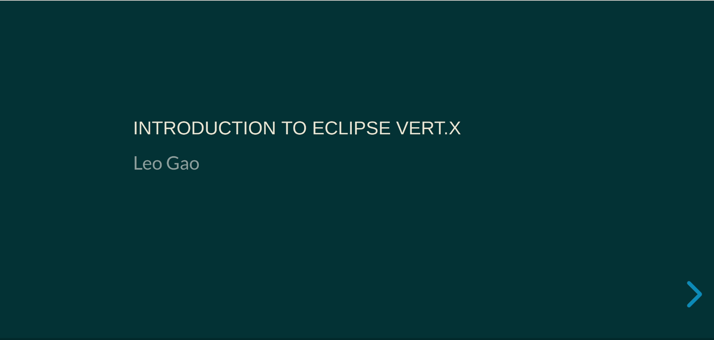

# Slides
This project provides an easy way to produce HTML slides based on [reveal.js](https://github.com/hakimel/reveal.js/)

## How to use
The recommended way to use it is to run the Docker container.

In case you have a `slides` directory in your working directory,
run the following command can start a ready-to-use slides webapp for you. 

> docker run --rm -p 8080:8080 -v \`pwd\`:/opt/app aoingl/slides-app 

Now you can visit the slides:

>  http://localhost:8080/slides/

### Slides in 'slides' directory:

The most common way to design your reveal.js based slides using this project is to
have a `slides` directory in the current working directory. 

Suppose you are in working directory [samples](samples/):

> cd samples

The structure in `samples` directory is:
> tree samples

    samples
    └── slides
        └── free_talk                  # the slide name can be overriden 
            ├── reactive-traits.svg    # the image can be refered as relative link in the slide.html
            ├── Server.java            # sample file that can be refered to in the side.html as well
            ├── server.js              # sample file that can be refered to in the side.html as well
            ├── slide.html             # the main slide content (reveal.js defined content)
            └── slide.json             # customized freemarker context used in default slide template

After running above command, the slide in `slides/free_talk` can be accessed using link:
> http://localhost:8080/slides/free_talk/

Any changes in the slides will take effect immediately.

### Slides in a zip file

Sometime you may want to share your slides, it is better to have it zipped.

You can simply put the zip file in the `slides_zip` directory in the current working directory.

If the slides are packaged into a zip file, like the `my_talk.zip` in the
`slides_zip` directory in the working directory, it can be accessed using link:

> http://localhost:8080/slides/my_talk/

The `my_talk.zip` file structure is just like the `free_talk` directory:

    [🎩 lgao@lgao slides]$ unzip -l slides_zip/my_talk.zip 
    Archive:  slides_zip/my_talk.zip
      Length      Date    Time    Name
    ---------  ---------- -----   ----
        27360  06-19-2019 16:37   use_mouse.jpg
          141  06-19-2019 16:40   slide.html
           40  06-19-2019 16:40   slide.json
    ---------                     -------
        27541                     3 files

## How to build

> mvn clean install -Papp

Use the profile `app` to build the `slides-app.jar`

## How to release

> mvn clean install -Psonatype-oss-release

This will build the all ready to deploy artifiacts
